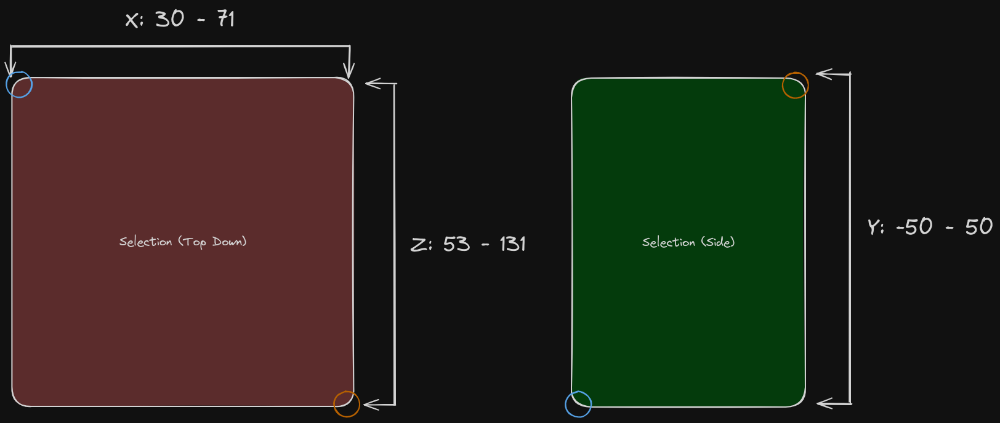

CommonMCOBJ is a spec to allow Minecraft OBJ exporters to provide extra metadata about the source world and OBJ (that would otherwise be lost) in a standard way.

Table of Contents
=================

* [Table of Contents](#table-of-contents)
* [Motivation](#motivation)
* [Goals](#goals)
   * [Non-Goals](#non-goals)
* [Credits](#credits)
* [Spec](#spec)
   * [Common Header](#common-header)
      * [Custom Headers](#custom-headers)
   * [Selections](#selections)
      * [Interoperability with Selections](#interoperability-with-selections)
   * [Offsets](#offsets)
   * [Split Blocks](#split-blocks)

<!-- Created by https://github.com/ekalinin/github-markdown-toc -->

# Motivation
OBJ exporters are a vital piece of software for Minecraft artists. Without them, artists would not be able to bring their creations in Minecraft into the world of 3D software. 

Over the years plugins for artists such as MCprep have come on the scene to improve Minecraft animation workflows in general purpose software such as Blender. Many of these tools perform tasks on OBJs that would otherwise be to time consuming for regular users.

However, plugins in 3D software depend on certain information about that OBJ that, more often than not, is not provided, most commonly whether texture atlases are used or not. In addition, many users are unsatisfied with current limitations that exist with said software, such as lack of biome colors, which can only be provided by OBJ exporters, as they have full knowledge of the world being exported.

To address these problems, the CommonMCOBJ spec defines a set of conventions for OBJ exporters to act as a glue between plugins in 3D software, the export properties of the OBJ, and the source world for the OBJ.

# Goals
- Universal across all OBJ exporters (no keys for specific exporters).
- Exportable by OBJ exporters.
- Easy to parse for software.
- Pack as much metadata as possible to the OBJ and MTL files, and only use standard formats when a separate file is absolutely needed.
- Works across all 3D software.

## Non-Goals
- Governing every behavior in Minecraft OBJ exporters; that would be hard to adopt and stifle experimentation.
- Mod support; CommonMCOBJ is based around vanilla Minecraft data, as standardizing behavior for mod support would be complex to adopt.

# Credits
- Eric Haines (Mineways) for the Mineways header, which has used as reference for the CommonMCOBJ [Header](#common-header)
- James Horsley (jmc2OBJ) for his work on CommonMCOBJ [Selections](#selections)
- Patrick W. Crawford (Moo-Ack! Productions/MCprep) for defining CommonMCOBJ [Offsets](#offsets) with James Horsley
- Mahid Sheikh (Moo-Ack! Productions/MCprep) for starting the CommonMCOBJ spec and [cmc2OBJ](https://github.com/CommonMCOBJ/cmc2obj)


# Spec
The following defines the spec for CommonMCOBJ Version 1. Unless marked otherwise, everything in defined is a requirement for exporters implementing CommonMCOBJ.

For reference, see [cmc2OBJ](https://github.com/CommonMCOBJ/cmc2obj), which acts as the reference implementation of CommonMCOBJ.

## Common Header
_Credit to the OBJ header from Mineways (by Eric Haines), which has been used as reference for the CommonMCOBJ header_

OBJs following the CommonMCOBJ spec will have a header at the start of the file to give special information about the OBJ and source world. *Parenthesis are necessary*.

It is structured as follows:
```py
# COMMON_MC_OBJ_START
# version: 1
# exporter: Name of the exporter, all lowercase, with spaces substituted by underscores 
#
# world_name: Name of the source world
# world_path: Path of the source world*
#
# export_bounds_min: (min X, min Y, min Z)
# export_bounds_max: (max X, max Y, max Z)
# export_offset: (X, Y, Z)
# block_scale: scale of blocks in meters; default is 1 meter
#
# is_centered: true if centered, false if not
# z_up: true if the Z axis is up instead of Y, false is not
# texture_type: ATLAS or INDIVIDUAL_TILES
# has_split_blocks: true if blocks have been split, false if not
#
# COMMON_MC_OBJ_END
```


Using Python as a representation of the header:
```py
# Assumed types:
# int   - 32 bit, signed integer
# uint  - 32 bit, unsigned integer
# float - 32 bit floating point value
# bool  - true or false
# str   - string of characters
class CommonMCOBJ:
    # Version of the CommonMCOBJ spec
    version: uint

    # Exporter name in all lowercase
    exporter: str 
    
    # Name of source world
    world_name: str 

    # Path of source world*
    world_path: str 

    # Min values of the selection bounding box
    exported_bounds_min: (int, int, int)

    # Max values of the selection bounding box
    exported_bounds_max: (int, int, int)  

    # Offset from (0, 0, 0)
    export_offset: (float, float, float)
   
    # Scale of each block in meters; by default, this should be 1 meter
    block_scale: int
    
    # Is the OBJ's origin centered to the geometry?
    is_centered: bool

    # Is the Z axis of the OBJ considered up?
    z_up: bool

    # Are the textures using large texture atlases or 
    # individual textures?
    texture_type: "ATLAS" | "INDIVIDUAL_TILES"

    # Are blocks split by type?
    has_split_blocks: bool
```

\* UNIX paths, so `\` in Windows paths would be replaced with `/`


Beyond tabs being forbidden, formatting of the header does not matter, only the order. Exporters may choose to add additional blank lines or remove them if they so wish.

### Custom Headers
Exporters may export their own separate headers as a form of backward compatibility, or to provide extra information that is not supported in CommonMCOBJ. Software can then use the `exporter` key to determine when to use these extra headers.

```py
# COMMON_MC_OBJ_START
# version: 1
# exporter: example_exporter
# ...
# COMMON_MC_OBJ_END

# Custom header
# ...
```

These can be placed above or below the CommonMCOBJ header as the CommonMCOBJ header defines start and end markers, so the following is also allowed:
```py
# Custom header
# ...

# COMMON_MC_OBJ_START
# version: 1
# exporter: example_exporter
# ...
# COMMON_MC_OBJ_END
```

## Selections
_Credit goes to James Horsley from jmc2OBJ for the standard definition of selections_

An OBJ selection is a bounding box that defines what part of a world is exported. This selection does not have to be restricted to full chunks, but it does have to be restricted to full blocks.

In CommonMCOBJ, this bounding box is defined with 2 variables that define the minimum and maximum coordinates; these coordinates are given in the form `(X, Y, Z)`, where the `Y` component represents the height. These coordinates will be used to determine the length, width, and height of the bounding box for the selection. This uses the coordinates of the outermost exported blocks in the selection (i.e., the blocks on the edges).

As an example, say we have an OBJ exported from a selection of 2 points in `(X, Z)` form: `(30, 131)` and `(71, 53)`, inclusive, with a max depth of up to `-50` and a max height of up to `50`. In this example, the `X` and `Z` components of the minimum coordinate will be `30` and `53` respectively, and the `X` and `Z` components of the maximum coordinate will be `71` and `131` respectively. 

The `Y` components for the coordinates are set to the max height and max depth values. Therefore, the bounding box for this example will be defined with a minimum coordinate of `(30, -50, 131)` and a maximum coordinate of `(71, 50, 53)`. 

The bottom image is a visual representation of the example given. The blue circle represents the minimum coordinate, and the orange circle represents the maximum coordinate.


For extra reference, see [James Horsley's example](https://github.com/jmc2obj/j-mc-2-obj/issues/243#issuecomment-2014170837).

### Interoperability with Selections
> [!NOTE]
> Not a requirement.

OBJ Exporters may use CommonMCOBJ selections as a form of interoperability between OBJ exporters by "importing" a previously exported OBJ and setting selection bounds based on the CommonMCOBJ metadata. CommonMCOBJ will allow for that.

## Split Blocks
> [!NOTE]
> Not a requirement

OBJ exporters may split blocks into separate objects, where each block type is split as its own object.

## Offsets
_Credit goes to James Horsley from jmc2OBJ and Patrick W. Crawford from Moo-Ack! Productions/MCprep for the standard definition of offsets_

Offsets are defined as the coordinate offsets from the center of the [Selection's](#selections) volume in meters (it should be kept in mind that [Selections](#selections) are 3D bounding boxes). This offset can be any floating point value and is not based off of Minecraft coordinates, but rather world space in 3D software.
